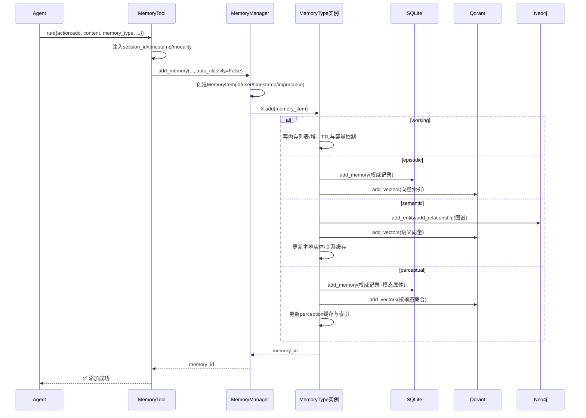
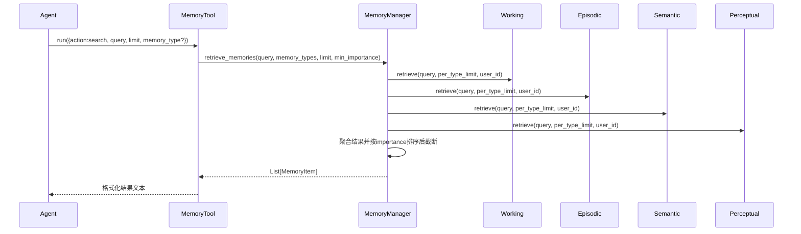
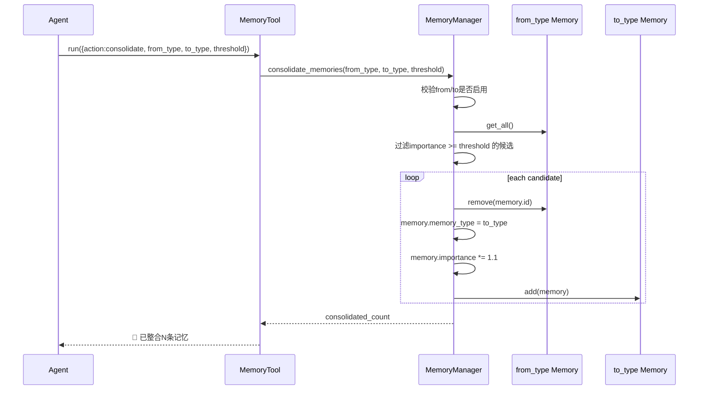
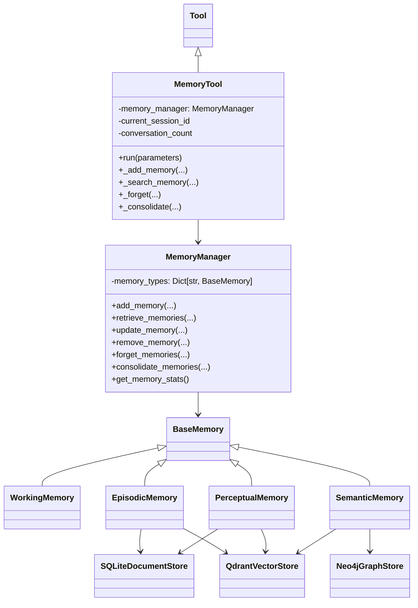
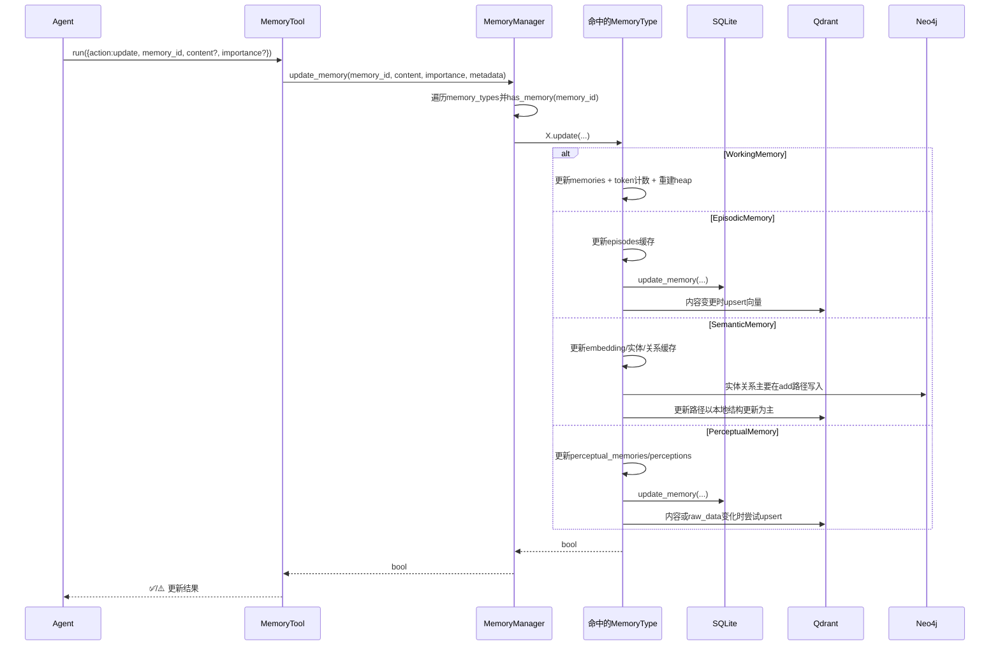
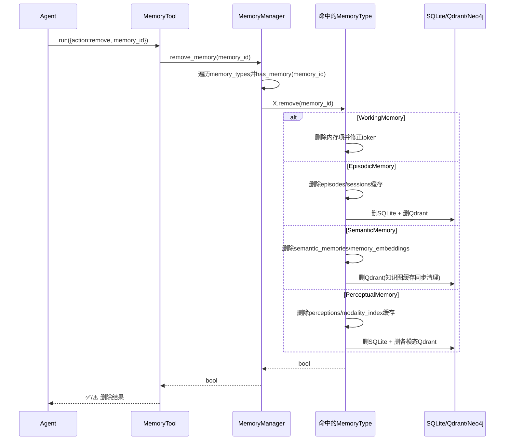
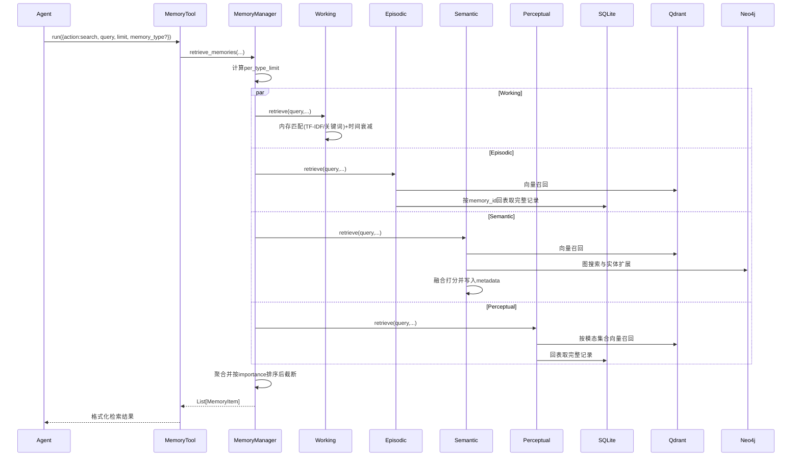

# 记忆模块速查（MemoryTool / MemoryManager）

## 1) 一图一链路（按代码实际）

- `SimpleAgent` 通过 `ToolRegistry` 调用 `MemoryTool.run(...)`
- `MemoryTool` 只做参数分发、会话元数据补充、结果格式化
- `MemoryManager` 负责统一编排（按类型分发、聚合检索、遗忘/整合）
- 具体读写行为在各 Memory Type 内部完成：
  - `WorkingMemory`
  - `EpisodicMemory`
  - `SemanticMemory`
  - `PerceptualMemory`

---

## 2) 各记忆类型：写内存 / 写数据库矩阵

| 记忆类型 | 内存缓存 | SQLite | Qdrant | Neo4j | 说明 |
|---|---|---|---|---|---|
| Working | `memories` + `heap` | 否 | 否 | 否 | 短期工作集，仅会话内高频访问 |
| Episodic | `episodes/sessions` | 是（权威） | 是（向量索引） | 否 | 事件型长期记忆，结构化过滤+向量召回 |
| Semantic | `semantic_memories/entities/relations` | 否（当前实现） | 是（向量检索） | 是（知识图谱） | 概念/关系推理型记忆 |
| Perceptual | `perceptual_memories/perceptions` | 是（权威） | 是（按模态多集合） | 否 | 多模态内容，文本/图像/音频分集合 |

### 使用到的数据库（按代码）

- 关系型：`SQLiteDocumentStore` -> `memory_data/memory.db`
- 向量库：`QdrantVectorStore`（默认集合 `hello_agents_vectors`，感知记忆按模态后缀拆分）
- 图数据库：`Neo4jGraphStore`（语义记忆）

## 3) 为什么要区分“内存态”与“数据库态”

- 低延迟与高频更新：内存态用于当前会话快速读写（尤其 `WorkingMemory`）
- 持久化与跨会话恢复：SQLite/Neo4j/Qdrant 承担长期保存与索引
- 检索能力分工：
  - SQLite：结构化过滤（时间、类型、阈值）
  - Qdrant：语义近邻召回
  - Neo4j：实体关系与图推理
- 工程上解耦：把“权威存储”和“检索索引”拆开，便于替换后端与独立扩容

## 4) 核心时序图（最重要）

## 4.1 添加记忆（`action=add`）



## 4.2 检索记忆（`action=search`）



## 4.3 遗忘记忆（`action=forget`）

```mermaid
sequenceDiagram
    participant A as Agent
    participant T as MemoryTool
    participant M as MemoryManager
    participant W as Working
    participant E as Episodic
    participant S as Semantic
    participant P as Perceptual
    participant DB as SQLite/Qdrant/Neo4j

    A->>T: run({action:forget, strategy, threshold/max_age_days})
    T->>M: forget_memories(strategy, threshold, max_age_days)
    M->>W: forget(...)
    M->>E: forget(...)
    M->>S: forget(...)
    M->>P: forget(...)

    alt working
        W->>W: 仅清理内存(按TTL/重要性/容量)
    else episodic / semantic / perceptual
        Note over E,S,P: 先判定待遗忘ID，再逐条remove()
        E->>DB: 删SQLite + 删Qdrant
        S->>DB: 删Qdrant(并清理本地图缓存)
        P->>DB: 删SQLite + 删Qdrant(多模态集合)
    end

    M->>M: 汇总各类型forgotten_count
    M-->>T: total_forgotten
    T-->>A: 🧹 已遗忘N条记忆
```

## 4.4 记忆整合（`action=consolidate`）



---

## 5) 代码架构与类图（简化）



---

## 6) 各模块逻辑（超简版）

- `WorkingMemory`
  - 纯内存短期记忆，`TTL + 容量 + token` 三重约束
  - 检索为 TF-IDF/关键词混合，结果再乘时间衰减与重要性
- `EpisodicMemory`
  - 事件先写内存缓存，再写 SQLite（权威）+ Qdrant（索引）
  - 检索优先向量召回，再回 SQLite 拉完整记录并融合近因/重要性
- `SemanticMemory`
  - 提取实体关系 -> 写 Neo4j，文本向量写 Qdrant
  - 检索走“向量 + 图”混合排序，支持实体关联扩展
- `PerceptualMemory`
  - 处理 text/image/audio，多模态编码后写 SQLite + 分模态 Qdrant
  - 检索以同模态向量检索为主，关键词为回退

---

## 7) 数据结构流转（用户输入 -> 内存/数据库）

## 7.1 通用流转（所有类型都会经过）

1. 用户通过工具调用（示例）：

```json
{
  "action": "add",
  "content": "用户偏好使用Python进行数据分析",
  "memory_type": "semantic",
  "importance": 0.8
}
```

2. `MemoryTool` 注入运行态元数据（代码里固定会补）：

```json
{
  "session_id": "session_20260329_101530",
  "timestamp": "2026-03-29T10:15:30.123456"
}
```

3. `MemoryManager` 统一构造 `MemoryItem`：

```python
MemoryItem(
  id="9de9e1d9-6b7c-4be8-8f78-3d5a9e15b3e1",
  content="用户偏好使用Python进行数据分析",
  memory_type="semantic",
  user_id="user123",
  timestamp=datetime(...),
  importance=0.8,
  metadata={"session_id": "...", "timestamp": "..."}
)
```

---

## 7.2 WorkingMemory（仅内存，不落库）

- 用户输入示例：

```json
{
  "action": "add",
  "content": "这轮对话重点是优化检索速度",
  "memory_type": "working",
  "importance": 0.7
}
```

- 写入后的内存结构：
  - `self.memories.append(memory_item)`
  - `self.memory_heap.push((-priority, timestamp, memory_item))`
  - `self.current_tokens += len(content.split())`

- 示例（简化）：

```python
self.memories[-1] = MemoryItem(
  id="a111...",
  memory_type="working",
  content="这轮对话重点是优化检索速度",
  importance=0.7,
  metadata={"session_id": "...", "timestamp": "..."}
)

self.memory_heap[0] = (-0.68, datetime(...), <MemoryItem a111...>)
```

---

## 7.3 EpisodicMemory（内存缓存 + SQLite权威 + Qdrant索引）

- 用户输入示例：

```json
{
  "action": "add",
  "content": "用户询问如何部署服务，助手给出Docker步骤",
  "memory_type": "episodic",
  "importance": 0.85
}
```

- 内存结构变化：
  - 生成 `Episode(...)`
  - `self.episodes.append(episode)`
  - `self.sessions[session_id].append(episode_id)`

- `Episode` 结构（代码字段）：

```python
Episode(
  episode_id="b222...",
  user_id="user123",
  session_id="session_20260329_101530",
  timestamp=datetime(...),
  content="用户询问如何部署服务，助手给出Docker步骤",
  context={},
  outcome=None,
  importance=0.85
)
```

- SQLite `memories` 表写入（`memory_type='episodic'`）：
  - 列：`id, user_id, content, memory_type, timestamp, importance, properties`
  - `properties` 示例：

```json
{
  "session_id": "session_20260329_101530",
  "context": {},
  "outcome": null,
  "participants": [],
  "tags": []
}
```

- Qdrant payload 示例（向量索引）：

```json
{
  "memory_id": "b222...",
  "user_id": "user123",
  "memory_type": "episodic",
  "importance": 0.85,
  "session_id": "session_20260329_101530",
  "content": "用户询问如何部署服务，助手给出Docker步骤",
  "timestamp": 1760000000,
  "added_at": 1760000000
}
```

---

## 7.4 SemanticMemory（内存缓存 + Qdrant + Neo4j）

- 用户输入示例：

```json
{
  "action": "add",
  "content": "张三在OpenAI做多模态模型研究",
  "memory_type": "semantic",
  "importance": 0.9
}
```

- 内存结构变化：
  - `self.semantic_memories.append(memory_item)`
  - `self.memory_embeddings[memory_id] = embedding(np.ndarray)`
  - `self.entities[entity_id] = Entity(...)`
  - `self.relations.append(Relation(...))`
  - `memory_item.metadata["entities"/"relations"]` 被补充

- Qdrant payload 示例：

```json
{
  "memory_id": "c333...",
  "user_id": "user123",
  "content": "张三在OpenAI做多模态模型研究",
  "memory_type": "semantic",
  "importance": 0.9,
  "entities": ["entity_xxx", "entity_yyy"],
  "entity_count": 2,
  "relation_count": 1,
  "timestamp": 1760000000,
  "added_at": 1760000000
}
```

- Neo4j 存储结构（代码实际）：
  - 实体节点：`(:Entity {id, name, type, ...})`
  - 关系：`(:Entity)-[:CO_OCCURS {memory_id, user_id, importance, evidence, ...}]->(:Entity)`
  - `memory_id`/`user_id`/`importance` 存在于节点属性和关系属性中，用于回溯来源记忆

---

## 7.5 PerceptualMemory（内存缓存 + SQLite权威 + Qdrant分模态）

- 用户输入示例（图片）：

```json
{
  "action": "add",
  "content": "这是一张系统架构图",
  "memory_type": "perceptual",
  "importance": 0.75,
  "file_path": "/data/arch.png",
  "modality": "image"
}
```

- `MemoryTool` 额外注入：

```json
{
  "modality": "image",
  "raw_data": "/data/arch.png",
  "session_id": "session_20260329_101530",
  "timestamp": "2026-03-29T10:15:30.123456"
}
```

- 内存结构变化：
  - 生成 `Perception(perception_id, data, modality, encoding, data_hash)`
  - `self.perceptions[perception_id] = Perception(...)`
  - `self.modality_index["image"].append(perception_id)`
  - `memory_item.metadata` 补充 `perception_id/modality`
  - `self.perceptual_memories.append(memory_item)`

- `Perception` 示例（简化）：

```python
Perception(
  perception_id="perception_d444...",
  data="/data/arch.png",
  modality="image",
  encoding=[0.12, 0.87, ...],
  metadata={"source": "memory_system"}
)
```

- SQLite `properties` 示例（`memory_type='perceptual'`）：

```json
{
  "perception_id": "perception_d444...",
  "modality": "image",
  "context": {},
  "tags": []
}
```

- Qdrant 写入目标集合与 payload：
  - 集合：`hello_agents_vectors_perceptual_image`（按模态拆分）
  - payload：

```json
{
  "memory_id": "d444...",
  "user_id": "user123",
  "memory_type": "perceptual",
  "modality": "image",
  "importance": 0.75,
  "content": "这是一张系统架构图",
  "timestamp": 1760000000,
  "added_at": 1760000000
}
```

---

## 8) 生命周期补充：update / remove / retrieve

## 8.1 update：数据结构变化示例

- 用户输入示例：

```json
{
  "action": "update",
  "memory_id": "b222...",
  "content": "用户询问如何部署服务，助手给出Docker与K8s步骤",
  "importance": 0.92
}
```

- `MemoryManager.update_memory()` 路径：
  - 顺序遍历各记忆类型，先 `has_memory(memory_id)`，命中后调用该类型 `update(...)`

- 各类型更新后的结构变化（示例）：
  - `WorkingMemory`
    - `self.memories[i].content/importance/metadata` 更新
    - `self.current_tokens` 按旧新文本长度差值修正
    - `self.memory_heap` 重建（优先级重新计算）
  - `EpisodicMemory`
    - `self.episodes[i].content/importance/context/outcome` 更新
    - SQLite `memories` 行更新（`content/importance/properties`）
    - 若内容变化：重新 embedding，Qdrant 同 `memory_id` upsert 新向量/payload
  - `SemanticMemory`
    - `self.memory_embeddings[memory_id]` 更新为新 embedding
    - `self.semantic_memories` 中对应 `MemoryItem.content/importance/metadata` 更新
    - 重新抽取实体关系并更新本地 `entities/relations` 缓存
  - `PerceptualMemory`
    - `self.perceptual_memories` 中对应项更新
    - SQLite `memories` 行更新
    - 若 `content/raw_data` 变化：重编码并尝试向量 upsert

### update 时序图



---

## 8.2 remove：数据结构变化示例

- 用户输入示例：

```json
{
  "action": "remove",
  "memory_id": "c333..."
}
```

- `MemoryManager.remove_memory()` 路径：
  - 顺序遍历 `memory_types`，命中后执行该类型 `remove(memory_id)`

- 各类型删除后的结构变化（示例）：
  - `WorkingMemory`
    - 从 `self.memories` 删除项
    - `current_tokens` 扣减
    - 堆删除采用标记/后续重建策略
  - `EpisodicMemory`
    - 从 `self.episodes` 删除
    - 从 `self.sessions[session_id]` 删除对应 `episode_id`，空会话键清理
    - SQLite 删除 `memories.id=memory_id`
    - Qdrant 按 payload `memory_id` 删除向量
  - `SemanticMemory`
    - Qdrant 删除该 `memory_id` 向量
    - 从 `self.semantic_memories` 删除
    - 从 `self.memory_embeddings` 删除
  - `PerceptualMemory`
    - 从 `self.perceptual_memories` 删除
    - 从 `self.perceptions` 与 `self.modality_index` 删除 `perception_id`
    - SQLite 删除 `memories.id=memory_id`
    - 所有感知模态集合尝试删除该 `memory_id` 向量

### remove 时序图



---

## 8.3 retrieve：数据结构变化示例

- 用户输入示例：

```json
{
  "action": "search",
  "query": "部署服务",
  "limit": 6,
  "memory_type": null
}
```

- `MemoryManager.retrieve_memories()` 关键步骤（示例）：
  - `memory_types=None` 时检索所有启用类型
  - `per_type_limit = max(1, limit // len(memory_types))`
  - 分类型调用 `retrieve(...)` 得到 `List[MemoryItem]`
  - 聚合后按 `importance` 排序再截断为 `limit`

- 返回结果中的 `MemoryItem.metadata` 会因类型扩展：
  - `WorkingMemory`：基本沿用原 metadata（会话字段等）
  - `EpisodicMemory`：追加 `relevance_score/vector_score/recency_score`，并带 `session_id/context/outcome`
  - `SemanticMemory`：追加 `combined_score/vector_score/graph_score/probability`
  - `PerceptualMemory`：追加 `relevance_score/vector_score/recency_score`，并带 `modality/perception_id`

### retrieve 时序图（细化版）


