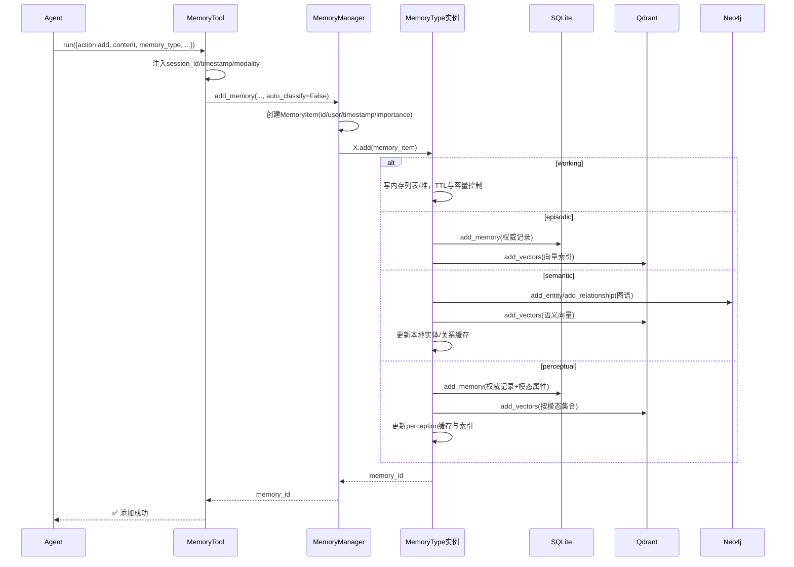
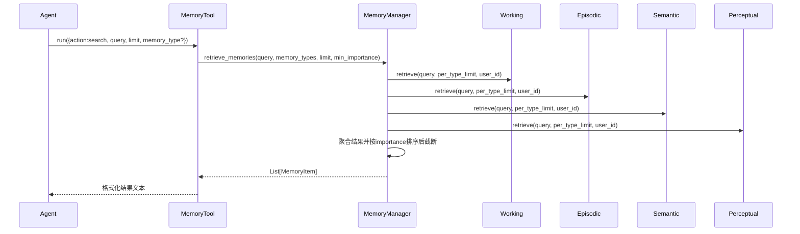
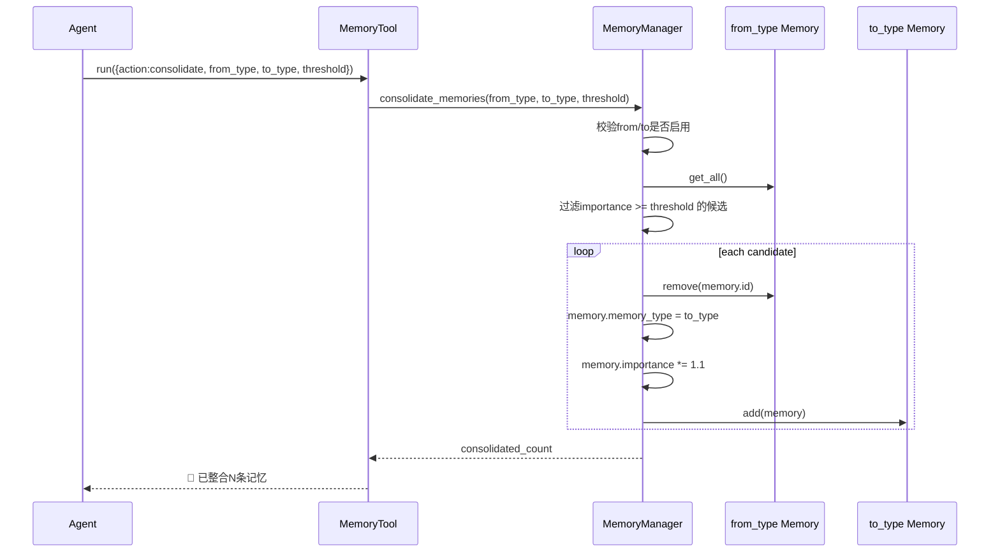
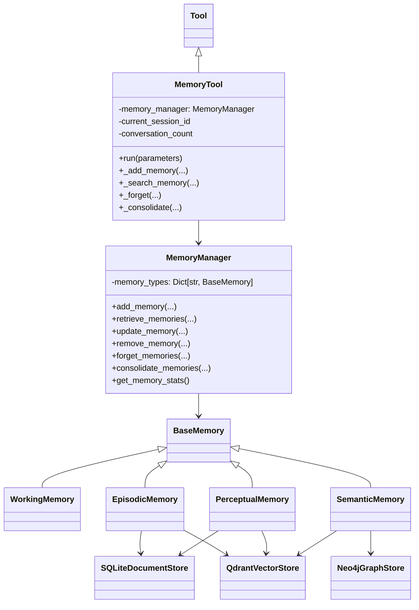

# 记忆模块速查（MemoryTool / MemoryManager）

## 1) 一图一链路（按代码实际）

- `SimpleAgent` 通过 `ToolRegistry` 调用 `MemoryTool.run(...)`
- `MemoryTool` 只做参数分发、会话元数据补充、结果格式化
- `MemoryManager` 负责统一编排（按类型分发、聚合检索、遗忘/整合）
- 具体读写行为在各 Memory Type 内部完成：
  - `WorkingMemory`
  - `EpisodicMemory`
  - `SemanticMemory`
  - `PerceptualMemory`

---

## 2) 各记忆类型：写内存 / 写数据库矩阵

| 记忆类型 | 内存缓存 | SQLite | Qdrant | Neo4j | 说明 |
|---|---|---|---|---|---|
| Working | `memories` + `heap` | 否 | 否 | 否 | 短期工作集，仅会话内高频访问 |
| Episodic | `episodes/sessions` | 是（权威） | 是（向量索引） | 否 | 事件型长期记忆，结构化过滤+向量召回 |
| Semantic | `semantic_memories/entities/relations` | 否（当前实现） | 是（向量检索） | 是（知识图谱） | 概念/关系推理型记忆 |
| Perceptual | `perceptual_memories/perceptions` | 是（权威） | 是（按模态多集合） | 否 | 多模态内容，文本/图像/音频分集合 |

### 使用到的数据库（按代码）

- 关系型：`SQLiteDocumentStore` -> `memory_data/memory.db`
- 向量库：`QdrantVectorStore`（默认集合 `hello_agents_vectors`，感知记忆按模态后缀拆分）
- 图数据库：`Neo4jGraphStore`（语义记忆）

## 3) 为什么要区分“内存态”与“数据库态”

- 低延迟与高频更新：内存态用于当前会话快速读写（尤其 `WorkingMemory`）
- 持久化与跨会话恢复：SQLite/Neo4j/Qdrant 承担长期保存与索引
- 检索能力分工：
  - SQLite：结构化过滤（时间、类型、阈值）
  - Qdrant：语义近邻召回
  - Neo4j：实体关系与图推理
- 工程上解耦：把“权威存储”和“检索索引”拆开，便于替换后端与独立扩容

## 4) 核心时序图（最重要）

## 4.1 添加记忆（`action=add`）



## 4.2 检索记忆（`action=search`）



## 4.3 遗忘记忆（`action=forget`）

```mermaid
sequenceDiagram
    participant A as Agent
    participant T as MemoryTool
    participant M as MemoryManager
    participant W as Working
    participant E as Episodic
    participant S as Semantic
    participant P as Perceptual
    participant DB as SQLite/Qdrant/Neo4j

    A->>T: run({action:forget, strategy, threshold/max_age_days})
    T->>M: forget_memories(strategy, threshold, max_age_days)
    M->>W: forget(...)
    M->>E: forget(...)
    M->>S: forget(...)
    M->>P: forget(...)

    alt working
        W->>W: 仅清理内存(按TTL/重要性/容量)
    else episodic / semantic / perceptual
        Note over E,S,P: 先判定待遗忘ID，再逐条remove()
        E->>DB: 删SQLite + 删Qdrant
        S->>DB: 删Qdrant(并清理本地图缓存)
        P->>DB: 删SQLite + 删Qdrant(多模态集合)
    end

    M->>M: 汇总各类型forgotten_count
    M-->>T: total_forgotten
    T-->>A: 🧹 已遗忘N条记忆
```

## 4.4 记忆整合（`action=consolidate`）



---

## 5) 代码架构与类图（简化）



---

## 6) 各模块逻辑（超简版）

- `WorkingMemory`
  - 纯内存短期记忆，`TTL + 容量 + token` 三重约束
  - 检索为 TF-IDF/关键词混合，结果再乘时间衰减与重要性
- `EpisodicMemory`
  - 事件先写内存缓存，再写 SQLite（权威）+ Qdrant（索引）
  - 检索优先向量召回，再回 SQLite 拉完整记录并融合近因/重要性
- `SemanticMemory`
  - 提取实体关系 -> 写 Neo4j，文本向量写 Qdrant
  - 检索走“向量 + 图”混合排序，支持实体关联扩展
- `PerceptualMemory`
  - 处理 text/image/audio，多模态编码后写 SQLite + 分模态 Qdrant
  - 检索以同模态向量检索为主，关键词为回退
